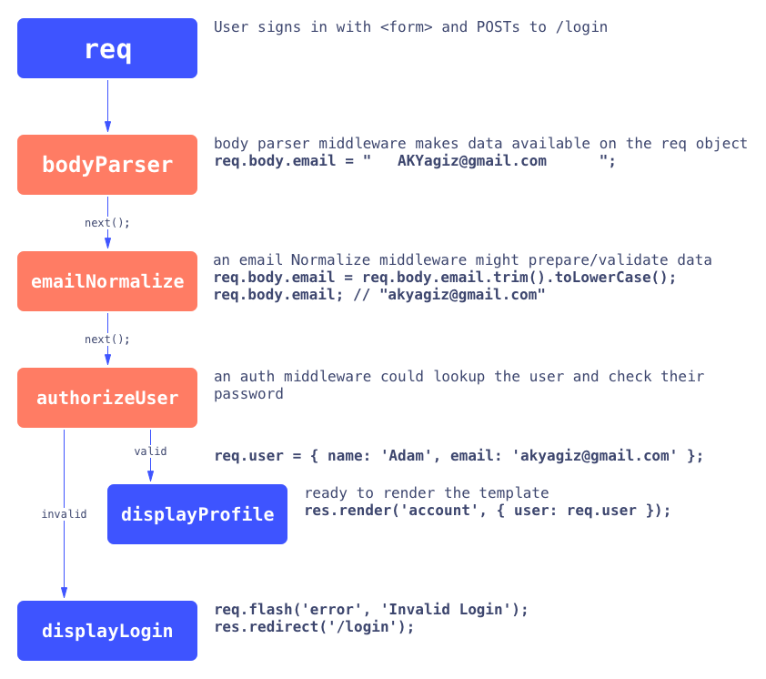

```javascript
// use variables as URL params to collect info
router.get('/reverse/:name', (req, res) => {
  const reverse = [...req.params.name].reverse().join('');
  res.send(reverse);
});

// use variables as URL params to collect info
router.get('/concat/:firstname/:lastname', (req, res) => {
  const fullName = `${req.params.firstname} ${req.params.lastname}`;
  res.send(fullName);
});
```


Make a new controller... Pull out the `(req, res)...` info and plop it into a new `xxxController.js` file!

```javascript
// Do work here
router.get('/', (req, res) => { // req and res are just short for request and response, respectively.
  const adam = { name: 'Adam', age: 37, cool: true, };
  // response.send() and response.json() are the 2 most common ways to send data to the client.
  // great for API endpoints.
  // res.send('Hey! It works!');
  // res.json(adam);
  // what if we have data in the URL? get it off of the request:
  // pluck right off of the query object
  // res.send(req.query.name);
  // want to return the whole query object, just to this:
  // res.send(req.query);
  // adam.name = req.query.name || adam.name;

  // for serving UI stuff, response.render(template, local vars) is going to be our main go to.
  res.render('hello', {
    name: req.query.name || 'Adam',
    age: 37,
    title: 'I love foods!'
  });
});
```

## Middleware: what is it and why do we use/need it?

```javascript
exports.homePage = (req, res) => {
  res.render('index');
};
```

In a standard method, we have a `req`uest (from the client to the server) and a `res`ponse (from the server, back to the client). In between the request and the response, sometimes a bunch of work needs to happen—maybe a call to a database, some data normalization, file upload, etc.

### Middleware visualized:



Middleware allows us to run code AFTER the request but BEFORE the response actually happens

#### Two types of middleware: route-specific and global

**Route-Specific Middleware**

This kind of middleware only gets executed for specific routes/urls.

```javascript
router.get('/', someController.myMiddleWare, someController.main);
```

**Global Middleware**

Every single request that goes through the application will run through the middleware before it even gets to your router! This is where you want to introduce any application-wide functionality/features/plug-ins/etc.

Most of `app.js` is defining and importing middleware to use in the app. Wherever you see `app.use(XYZ)`, we are telling the app to use the XYZ middleware!

```javascript
...
app.use(someMiddleware);
...
```

## Models

Models are where our data is stored/retreived/manipulated/etc. A model can describe what our data is going to look like ahead of time. In a spreadsheet analogy, you define the column headers for data you expect. A model can tell you what TYPE of data it expects (string, array, etc.), it can do some clean up when data is saved, and on and on.

**MongoDB Note**

MongoDB can be a "loose database" meaning you do not need to specify what your data will look like ahead of time (unlike SQL/MySQL where you set data types, lengths, etc.). However, out of the box, running in strict mode means you have to define your schema beforehand.

**Rule of thumb**

Try to do as much of the data normalization as close to the model as possible.

## GET/POST

Using routes, you can specify different behavior for request types GET and POST.

```javascript
// going to the /add url will return the result of addStore in the storeController
router.get('/add', storeController.addStore);

// however, POSTing data to the same url will trigger the createStore functionality of the storeController
router.post('/add', storeController.createStore);
```

## Working with the MongoDB database

Import Mongoose into the storeController to interface with MongoDB:

```javascript
const mongoose = require('mongoose');
```

Pull in the Store model:

```javascript
const Store = mongoose.model('Store');
```

Create a store in MongoDB:

```javascript
// set function as async to tell the browser there may be functions to await within:
exports.createStore = async (req, res) => {
  // create a new Store with the date passed from the /add form and pass it to the MongoDB handler:
  const store = new Store(req.body);
  // store.save() is called to finish our db request. await is added to make
  // sure the call completes before moving to the next line:
  await store.save();
  // toss a message to the node console, just for fun:
  console.log('Store data saved!');
  // redirect to the main page after successfully saving the data:
  res.redirect('/');
};
```

Alternatively...

```javascript
exports.createStore = async (req, res) => {
  // response from await (on the save() promise) will be stored in the store variable, giving us
  // immediate access to the slug property.
  const store = await (new Store(req.body)).save();
  req.flash('success', `Successfully created ${store.name}. Care to leave a review?`);
  console.log('Store data saved!', store);
  res.redirect(`/store/${store.slug}`);
};
```

## Flash Messages

Rather than redirecting the user to another page entirely, we can use flash messages to confirm something has happened but keep them on the current/desired page.

Flashes will only work if you use sessions.

## Querying MongoDB for stores

With the addStore form working and stores in the database, we need to find a way to retrieve the data and show it to the user.

```javascript
// Get store data from MongoDB
exports.getStores = async (req, res) => {
  // 1. Query the database for a list of all stores
  const stores = await Store.find();
  // 2. Pass the data to the stores template which will render the data
  res.render('stores', { title: 'Stores', stores });
};
```

## Saving LAT/LONG data for each store

There are many different types of data that can be stored in a MongoDB database. Our current schema is all strings (and an array of strings) but values could also include booleans, integers, and even other objects.

Before you start storing data, it's important to figure out just what kind of data that is going to be. Define the schema!

MongoDB has a bunch of built in custom queries for dealing with Dates, as well as stuff that is location based. Neat!

## Geocoding data with Google Maps

Create the autocomplete function which takes in references to three input elements: input (where we collect the address) and latInput/lngInput where we will populate the data from Google Maps API.

```javascript
function autocomplete(input, latInput, lngInput) {
  if (!input) return; // simple way to skip this if no input on the page
  console.log(input, latInput, lngInput);
  const dropdown = new google.maps.places.Autocomplete(input);

  dropdown.addListener('place_changed', () => { // google maps way to addEventListener
    const place = dropdown.getPlace();
    latInput.value = place.geometry.location.lat();
    lngInput.value = place.geometry.location.lng();

  });

  // if a user hits enter on the address field, don't submit the form yet
  input.on('keydown', (e) => {
    if (e.keyCode === 13) e.preventDefault();
  });
}

export default autocomplete;
```

## File Handling: Uploading and Resizing with Middleware

We want to add the ability to upload a photo when creating/editing a store. So, in three parts, we want to:

1. Edit the store form to accept file uploads.
1. Add some middleware to upload and resize the file to our specifications
1. ???

The multer middleware will handle file uploads for us in our form.

```javascript
const multer = require('multer'); // set up express to handle multipart form data
const multerOptions = {
  storage: multer.memoryStorage(), // save original file to memory for resizing
  fileFilter(req, file, next) {
    const isPhoto = file.mimetype.startsWith('image/'); // check file mimetype
    if (isPhoto) {
      next(null, true); // if mimetype is correct, move to next function
    } else {
      next({ message: `${file.mimetype} is not an allowed filetype!` }, false);
    }
  }
};
```

## Routing and Templating Single Stores

We'll create a single store layout to display a store entry.

1. Find the actual store with a given slug
1. Pull in the name, description, photo, map, etc. of the store
1. Show reviews and login forms

We need to:

1. Make a new route for our store pages
1. Make a controller
1. Controller to query the database
1. Controller will pass data to a template to render

```javascript
exports.getStoreBySlug = async (req, res, next) => {
  const store = await Store.findOne({ slug: req.params.slug });
  console.log(store);
  if (!store) {
    next();
    return;
  }
  res.render('store', {
    store,
    title: store.name
  });
};
```

## Using Pre-Save Hooks to Make Unique Slugs

When a store is added, it's possible that the resulting slug is the same as that of another store. If this happens, there's no way to know which store you're going to get when you hit the URL. To avoid this, we will check the slug of the new store against those already in the database and append a number for a unique slug.

```javascript
  const slugCheck = new RegExp(`^(${this.slug})((-[0-9]*$)?)$`, 'i');
  const storesWithSlug = await this.constructor.find({ slug: slugCheck });
  if (storesWithSlug.length > 0) {
    this.slug = `${this.slug}-${storesWithSlug.length + 1}`;
  }
```

## Custom MongoDB Aggregations

To display a list and count of store tags, it doesn't make sense to query every single store, loop over each tags array, and count each tag every time we want to see the data. This would become very slow and costly. Instead, we'll leverage MongoDB's aggregation.

```javascript
// add a method to our store schema
// must be a function() so we can use the "this" keyword
storeSchema.statics.getTagsList = function () {
  return this.aggregate([
    { $unwind: '$tags' }, // create new entries for each tag a store has
    { $group: { _id: '$tags', count: { $sum: 1 } } }, // create a new group based on the tag field then, in each of those groups, create yet another new field called count
    { $sort: { count: -1 } }
  ]);
};
```

## Multiple Query Promises with Async+Await

On the tags page, when we click a tag, we want to see all stores associated with that tag. This will use multiple queries inside a single controller method.

If we're running two queries that are NOT dependent on each other, they should NOT run synchronously.

```javascript
exports.getStoresByTag = async (req, res) => {
  const tag = req.params.tag;
  const tagQuery = tag || { $exists: true };
  const tagsPromise = Store.getTagsList();
  const storesPromise = Store.find({ tags: tagQuery });
  const [tags, stores] = await Promise.all([tagsPromise, storesPromise]);

  // const tags = await Store.getTagsList();
  res.render('tags', {
    title: 'Tags',
    tag,
    tags,
    stores
  });
};
```
